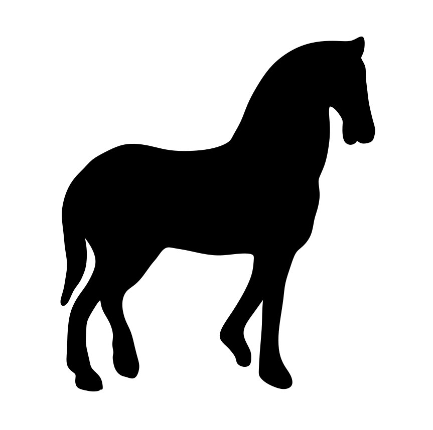
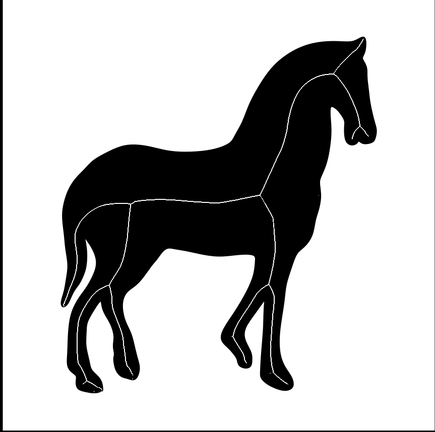
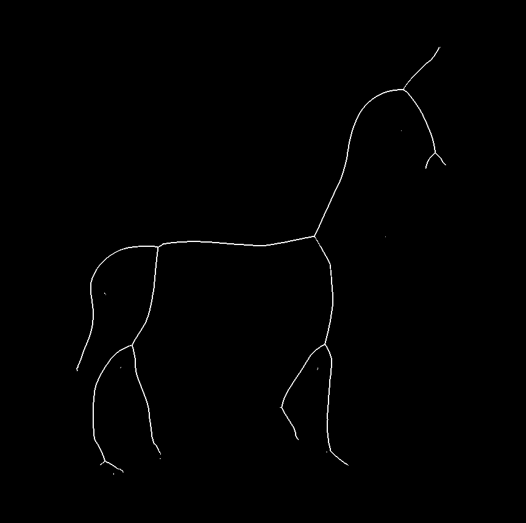
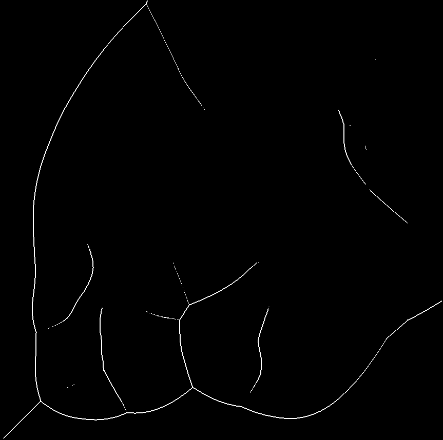
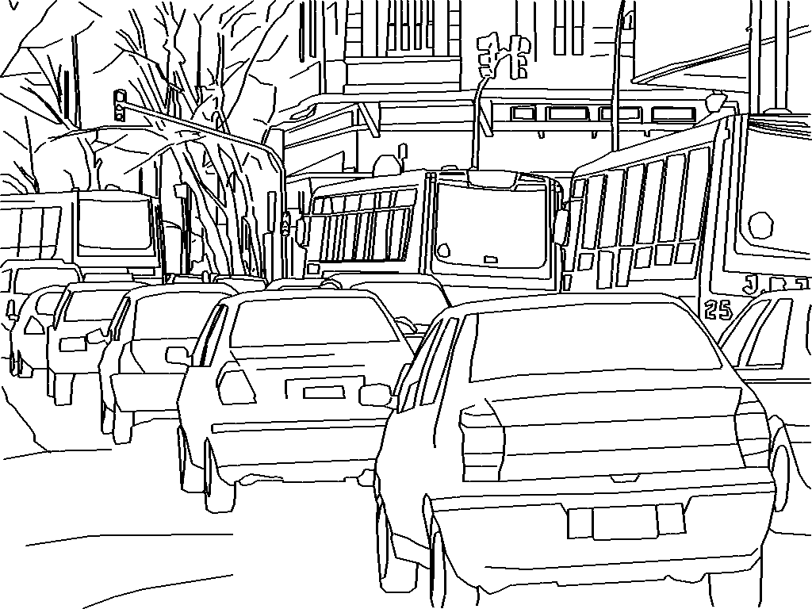
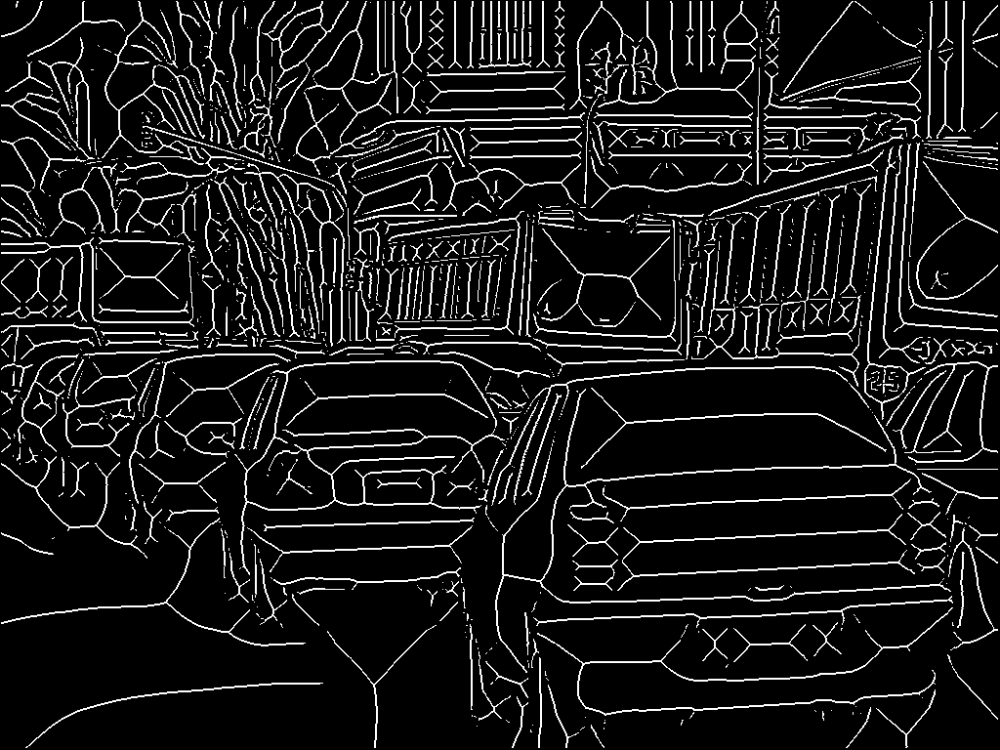

# 2D Average Outward Flux Skeletons
 

The medial axis, or _topological skeleton_, of an object &Omega; is the set of all points in &Omega; having more than one closest point on the object boundary, &part;&Omega;. This repository contains matlab code for computing the medial axis of binary images.

A binary image is one with only two pixel values or colors. This code (and all examples) use the convention that the two image colors are black and white, with pixel values 0 and 1 respectively.

The algorithm works on solid, filled in shapes (like the black horse above), as well as thin contours (see [Examples](#examples) section below).

In both cases, the medial axis is only computed in white regions; i.e. &Omega; is considered to be all white pixels in the image, and all black pixels are merely treated as object boundaries, or part of &part;&Omega;. See [Usage](#usage) below for more details.

## Setup
To download the code, open a terminal and type:
```
git clone https://github.com/gndowns/AOFSkeletons.git
```
This will create a directory `AOFSkeletons/` containing all of the code seen here.
<br>
## Usage
To compute the Skeleton of a single image, one can use our matlab function `generate_skeletons`. Navigate to the downloaded `AOFSkeletons/` folder and from the matlab console run:
```
>> generate_skeletons('path/to/your/image.png')
```

The skeleton for `image.png` will be computed and saved to `skeleton.png`. Any standard image format can be used.
<br>

**NOTE**: The algorithm only computes the skeleton for _white_ regions in the image. One can compute the skeleton in black regions by setting the optional `invert` argument to true,
```
>> generate_skeletons('path/to/your/image.png`, 'invert', true)
```

This is particulary useful if the input image is of a solid black object on a white background (like the horse above).


#### Saving Output to a File
To save the generated skeleton to an image file, use the optional argument `skeleton_path`, followed by an output image path:
```
>> generate_skeletons('path/to/your/image.png', 'skeleton_path', 'path/to/save/skeleton.png')
```

<br>

## Examples
You can generate the horse example shown above using the included image `images/horse_1.png`. Note the horse is solid black on a white bacground, so to generate the interior skeleton of the black region we will have to use the optional `invert` argument:
```
>> generate_skeletons('images/horse_1.png', 'images/horse_1_skeleton_int.png', 'invert', true)
```
 
<br>

By leaving out the invert option, we could also generate the skeleton of the background (white region):
```
>> generate_skeletons('images/horse_1.png', 'images/horse_1_skeleton_ext.png')
```
 
<br>

__Skeletons of Line Drawings__

As mentioned above,the algorithm also works for line drawings, or contour drawings. These are drawings of scenes with thin black lines outlining objects, such as the city scene below. The objects are not filled in, unlike in the horse example; we can then compute the medial axis for all white pixels in the image, with the black contours as the object boundary:
```
>> generate_skeletons('images/city_1.png', 'images/city_1_skeleton')
```

 

No inversion is necessary since the contours are black already.
<br>
<br>

## Performance
For faster performance, one can compile the `.m` matlab scripts included here to MEX binaries.

Open matlab and navigate to `AOFSkeletons/`. In the console, run:
```
>> compile_mex
```
This will create a folder `codegen/`, which contains auto-generate C code for the relevant `.m` files, which is then compiled to MEX.

<br>

## Updating
Assuming you have not made any local changes to these files, you can update your local code to the newest version with [git pull](https://git-scm.com/docs/git-pull).
Open a terminal, navigate to your `AOFSkeletons/` folder, and run
```
git pull
```

If you have edited any files, `git pull` may throw errors. You can update while keeping your local changes by running:
```
git stash
git pull
git stash pop
```

If you are new to git, you can learn more about it [here](https://git-scm.com/doc)
<br>
<br>

## References
If you use the AOF Skeleton package, we appreciate it if you cite the following papers:

````
@incollection{rezanejad2013flux,
  title={Flux graphs for 2D shape analysis},
  author={Rezanejad, Morteza and Siddiqi, Kaleem},
  booktitle={Shape Perception in Human and Computer Vision},
  pages={41--54},
  year={2013},
  publisher={Springer}
}
@inproceedings{dimitrov2003flux,
  title={Flux invariants for shape},
  author={Dimitrov, Pavel and Damon, James N and Siddiqi, Kaleem},
  booktitle={Computer Vision and Pattern Recognition, 2003. Proceedings. 2003 IEEE Computer Society Conference on},
  volume={1},
  pages={I--I},
  year={2003},
  organization={IEEE}
}
```
